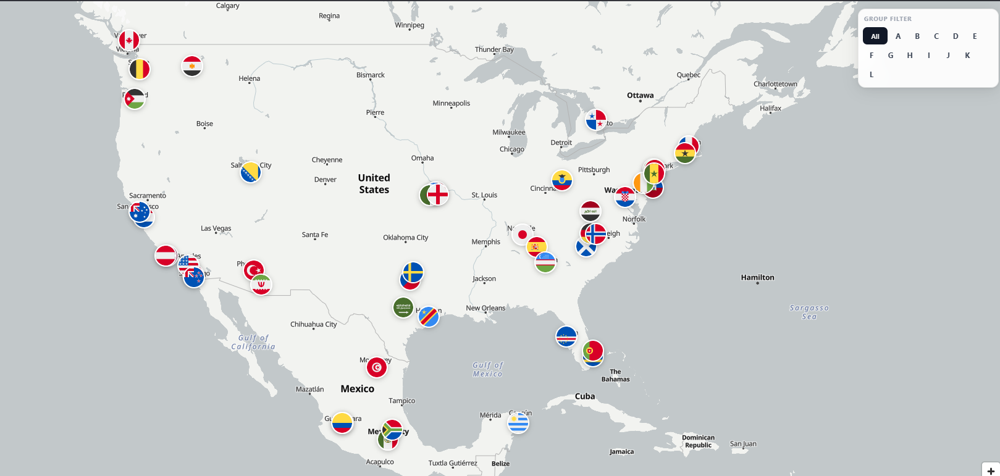

# 🏆 2026 FIFA World Cup — Team Base Camp Map
# 🏆 2026 世界杯球队基地可视化地图

[](https://brickspert-world-cup26-map.pages.dev/)
&nbsp;


> 🔗 **Live Demo：[brickspert-world-cup26-map.pages.dev](https://brickspert-world-cup26-map.pages.dev/)**



---

## About / 项目介绍

**English**
An interactive map visualizing the training base camps and hotels of all 48 teams participating in the 2026 FIFA World Cup, hosted across USA, Canada, and Mexico. Click any flag marker to see the team's training site and hotel. Filter by group using the A–L panel.

**中文**
交互式地图，展示 2026 FIFA 世界杯（美国 · 加拿大 · 墨西哥）全部 48 支参赛队的训练基地与官方酒店位置。点击国旗图标查看队伍详情，右上角可按小组（A–L）筛选。

---

## Features / 功能特点

| | |
|---|---|
| 🏳️ **48 Flag Markers / 48 个国旗 Marker** | Circular flag icons, zoom on hover, click to open info card<br>圆形国旗，hover 放大，点击弹出信息卡 |
| 📍 **Training Base + Hotel / 训练基地 + 酒店** | Venue name and full address for every team<br>每队显示场馆名称与完整地址 |
| 🔍 **Group Filter / 小组筛选** | 12 groups (A–L), non-selected teams fade out while keeping map context<br>A–L 共 12 组，非选中队伍淡化保留整体感 |
| 🌟 **Debut Teams / 首届参赛标注** | Cape Verde · Curaçao · Jordan · Uzbekistan |
| 🌐 **Fully Open Source / 完全开源免费** | No API key, no paid dependencies<br>无 API Key，无付费依赖 |

---

## Tech Stack / 技术栈

| Tech / 技术 | Purpose / 用途 |
|------|------|
| [MapLibre GL JS](https://maplibre.org/) v4.7 | Map rendering engine / 地图渲染引擎 |
| [OpenFreeMap Positron](https://openfreemap.org/) | Base map style, open-source & free, no token / 底图样式，开源免费，无 token |
| [Cloudflare Pages](https://pages.cloudflare.com/) | Static hosting + CDN / 静态托管 + CDN |
| [Circle Flags](https://github.com/HatScripts/circle-flags) | Circular flag SVGs / 圆形国旗 SVG |
| [Mapbox Geocoding API](https://docs.mapbox.com/api/search/geocoding/) | One-time address → coordinates / 一次性地址 → 坐标转换 |
| Node.js 18+ | Geocoding script (run once) / Geocoding 脚本（仅需运行一次）|

---

## Data Sources / 数据来源

- **FIFA Official** — [fwc26teambasecamps.fifa.com](https://fwc26teambasecamps.fifa.com/#/tbc/)
- **Community Aggregation** — [Reddit r/MLS: Map of the 2026 FIFA World Cup Team Base Camps](https://www.reddit.com/r/MLS/comments/1t4l169/map_of_the_2026_fifa_world_cup_team_base_camps/#lightbox)

数据字段：`team` · `country_code` · `group` · `training_site` · `training_address` · `hotel_name` · `hotel_address` · `confirmed`

---

## Local Development / 本地运行

```bash
# 1. Clone
git clone https://github.com/YOUR_USERNAME/YOUR_REPO.git
cd YOUR_REPO

# 2. 启动本地静态服务（需要 Node.js 18+）
node serve.cjs
# 打开 http://localhost:8000
```

### Re-run Geocoding / 重新 Geocoding（可选）

如需更新坐标数据，需要 Mapbox 账号的 Public Token：

```bash
# macOS / Linux
export MAPBOX_TOKEN="pk.xxx..."

# Windows PowerShell
$env:MAPBOX_TOKEN = "pk.xxx..."

node scripts/geocode.js
# 输出 data/teams.json，relevance < 0.7 的条目会打印警告
```

---

## Project Structure / 目录结构

```
├── index.html          # 入口页面
├── style.css           # 样式
├── map.js              # 地图逻辑（MapLibre GL JS）
├── serve.cjs           # 本地开发静态服务器
├── data/
│   ├── teams.csv       # 原始数据（UTF-8）
│   └── teams.json      # Geocoding 后的坐标数据
└── scripts/
    └── geocode.js      # 一次性 Geocoding 脚本（Node.js ESM）
```

---

## License / 许可

MIT

---

*Built with [Claude Code](https://claude.ai/code) &nbsp;·&nbsp; Deployed on [Cloudflare Pages](https://pages.cloudflare.com/)*
